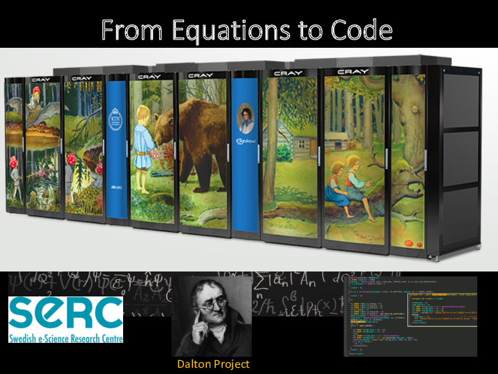
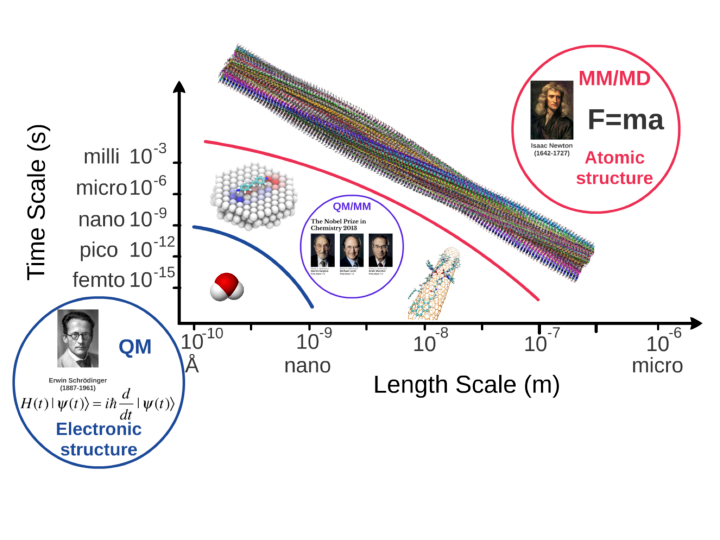
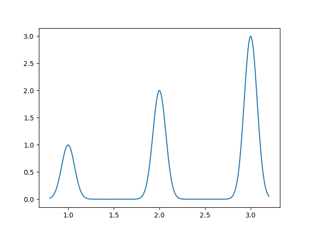
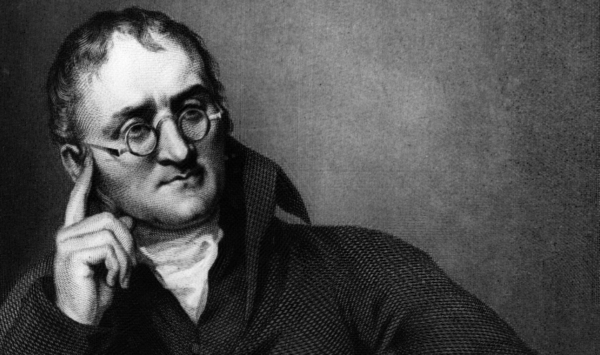
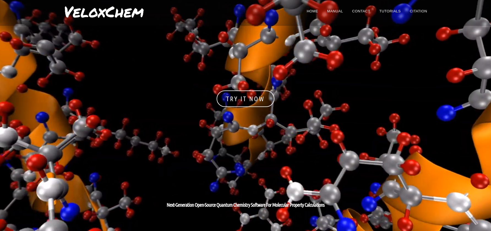
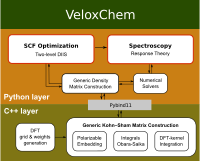

# VeloxChem
## Python meets quantum chemistry and HPC

### EuroSciPy2019

### Olav Vahtras 

---

layout: false

## About <a href="https://www.kth.se/profile/vahtras">me</a>

* Professor of Theoretical Chemistry
* KTH Royal Institute of Technology  
* Software Carpentry/Data Carpentry 
* Co-editor of <a href="http://www.scipy-lectures.org/">SciPy Lecture Notes</a>
* Teaching Python at master and Ph.D. levels
* Background in HPC

---

## What we do

---

## What we do in practice

* Solve large eigenvalue equations

$$
Ex = \lambda x
$$

* Solve large linear systems of equations

$$
(E-\omega S)N = V^\omega
$$

* Typical dimension $10^6$
* Matrix too large to store
* Solved by iteration

---
## Iterative solvers

* project equation on a reduces space of trial vectors

$$ (b^T(E-wS)b) (b^T N) = (b^T V) $$

* solve small problem with `numpy.linalg.solve` (lapack/mkl)

* calculate residual error - converged when small enough

$$ \tilde N = b(b^T N) $$
$$ R = (E - wS)\tilde N  - V$$

* generate new trial vector and repeat

---

## Our codes

* The Dalton project http://www.daltonprogram.org
* Research development tool since 1980s
* Mostly Fortran/C
* $ \gt 10^6 $ *SLOC*
* Open-source since 2016
* Successful (mostly) Scandinavian collaboration
* Code has evolved organically over > 30 years

---

### Problems

* No unit tests
* A number of (long) end to end tests
* Difficult to modify/extend

### However

* A lot of man-years invested
* A lot of functionality that will never be reimplemented
* Code will not go away
* Still ok for teaching

---

## Introducing VeloxChem

* First release October 2019
* Python driven 
* Modern C++ implementations with MPI/OpenMP

* https://veloxchem.org
* https://docs.veloxchem.org 

---

* High-level logic in Python
* Low-level numerical work in (C++ Pybind11)
* Combination of pytest and Google test unit testing
* Hosted on gitlab with CI

~~~
$ pip install veloxchem # after release
$ mpirun -N 100 python -m veloxchem molecule.inp molecule.out
~~~

---

### Status

* Manuscript submitted to Wiley Interdisciplinary Reviews: Computational Molecular Science
* VeloxChem: a Python-driven density-functional theory program for spectroscopy simulations in high-performance computing environments 

* Authors
    * Zilvinas Rinkevicius, 
    * Xin Li, 
    * Olav Vahtras, 
    * Karan Ahmadzadeh
    * Manuel Brand
    * Magnus Ringholm, 
    * Nanna Holmgaard List
    * Maximilian Scheurer
    * Mikael Scott, 
    * Andreas Dreuw, 
    * Patrick Norman

* Adaptation for GPU in progress

---

## Summary

* VeloxChem - a new quantum chemistry program aimed at spectroscopies
* Open source
* Easy to obtain and install (pip)
* Runs on large-scale HPC clusters
* Highly competitive with other similar softwars

